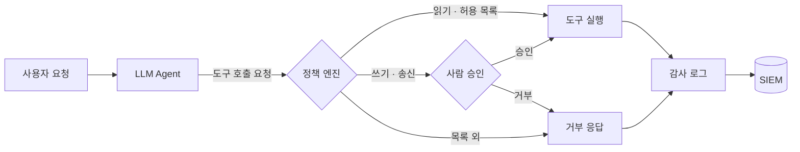

LLM 에이전트에 도구를 연결하는 순간, 에이전트는 새로운 **권한 주체**가
된다. 그리고 이 주체에는 기존 권한 모델에 없던 전제가 하나 붙는다:
**입력만으로 행동이 조작될 수 있다.** 프롬프트 인젝션은 패치 가능한
버그가 아니라 LLM의 동작 특성이므로, 권한 설계는 "인젝션이 성공한다"를
전제로 해야 한다.

## 위협 모델: 치명적 3요소

에이전트 보안 사고는 대부분 세 가지 능력이 한 에이전트에 동시에 주어질
때 발생한다.

1. **민감 데이터 접근** — 내부 문서, DB, 자격 증명
2. **신뢰할 수 없는 콘텐츠 처리** — 웹 페이지, 이메일, 사용자 업로드
3. **외부 송신 채널** — HTTP 요청, 이메일 발송, 코드 실행

셋이 모이면 공격 경로는 단순하다. 웹 페이지에 숨긴 지시문(2)이
에이전트로 하여금 내부 데이터를 읽어(1) 공격자 서버로 전송(3)하게
만든다. 설계 원칙: **세 능력을 한 에이전트 인스턴스에 모두 주지 않는다.**
불가피하다면 송신 채널에 사람 승인을 끼운다.

## 권한 검사 흐름

권한 검사는 LLM 바깥, 즉 도구 실행 레이어에서 결정론적으로 수행해야
한다. "시스템 프롬프트로 하지 말라고 했다"는 통제가 아니다.



## 정책 레이어 구현 패턴

핵심은 네 가지다: 기본 거부, 호출 횟수 제한, 위험 등급별 승인, 전량
로깅.

```python title="tool_policy.py"
from dataclasses import dataclass, field
from datetime import datetime, timezone
import json


@dataclass
class ToolPolicy:
    max_calls: int
    require_approval: bool = False
    allowed_args: dict = field(default_factory=dict)


POLICIES: dict[str, ToolPolicy] = {
    "read_file":  ToolPolicy(max_calls=50, allowed_args={"root": "/workspace"}),
    "search_web": ToolPolicy(max_calls=10),
    # 쓰기·송신 도구는 사람 승인 필수
    "write_file": ToolPolicy(max_calls=5, require_approval=True),
    "http_post":  ToolPolicy(max_calls=3, require_approval=True),
}


def check_tool_call(tool: str, args: dict, call_count: int) -> tuple[bool, str]:
    policy = POLICIES.get(tool)
    if policy is None:
        return False, "policy: default-deny"          # 목록에 없으면 거부
    if call_count >= policy.max_calls:
        return False, "policy: rate-limit"            # 루프·폭주 차단
    root = policy.allowed_args.get("root")
    if root and not str(args.get("path", "")).startswith(root):
        return False, "policy: path-escape"           # 경로 탈출 차단
    if policy.require_approval:
        return False, "policy: needs-human-approval"  # 승인 큐로 회부
    return True, "allowed"


def audit_log(tool: str, args: dict, verdict: str) -> None:
    print(json.dumps({
        "ts": datetime.now(timezone.utc).isoformat(),
        "tool": tool,
        "args": args,
        "verdict": verdict,
    }))
```

주의할 점: 승인 UI에 도구 호출 **원문 인자**를 보여줘야 한다. "파일을
저장합니다" 같은 요약은 에이전트가 생성하므로, 인젝션된 에이전트는
요약도 거짓으로 만들 수 있다.

## 자격 증명 설계

에이전트가 쓰는 자격 증명은 사람보다 엄격하게 묶는다.

- **세션 단위 단명 토큰**: 작업 시작 시 발급, 종료 시 폐기. AWS라면
  `sts:AssumeRole` + 세션 정책으로 해당 작업에 필요한 권한만 교부
- **사용자 권한 위임이 아닌 교차 검증**: 에이전트가 사용자 A를 대신해
  작업해도, A의 전체 권한이 아니라 "A 권한 ∩ 에이전트 허용 범위"만
- **도구별 자격 증명 분리**: 검색 도구의 키로 내부 DB에 접근할 수 없도록

## 운영: 감사 로그에 남겨야 할 것

| 필드 | 이유 |
| --- | --- |
| 도구 이름 + 전체 인자 | 사후 조사의 기본 단위 |
| 호출 트리거가 된 입력 출처 | 인젝션 경로 역추적 (사용자 vs 외부 콘텐츠) |
| 정책 판정 결과와 사유 | 거부 패턴 모니터링 — 공격 시도 신호 |
| 세션/대화 ID | 다단계 공격 체인 재구성 |

거부 로그는 버리지 말 것. **짧은 시간에 반복되는 정책 거부는 인젝션
시도의 가장 뚜렷한 신호다.**

## 마무리

에이전트 권한 설계의 질문은 "에이전트가 무엇을 할 수 있는가"가 아니라
**"최악의 입력을 받은 에이전트가 무엇까지 할 수 있는가"**다. 정책
엔진은 LLM 바깥에, 승인은 사람에게, 증적은 전량 — 이 세 가지가
출발점이다.
