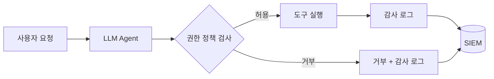

> 이 글은 frontmatter 형식 예시용 placeholder입니다 (MDX + Mermaid 예시 포함). 실제 내용으로 교체하세요.

## 에이전트는 새로운 권한 주체다

LLM 에이전트는 프롬프트 인젝션에 의해 의도와 다른 도구 호출을 할 수
있습니다. 따라서 에이전트가 쓰는 자격 증명은 사람보다 더 엄격한 최소
권한으로 묶어야 합니다.

## 권한 검사 흐름



## 정책 예시

```python title="tool_policy.py"
ALLOWED_TOOLS = {
    "read_file": {"max_calls": 50},
    "search_web": {"max_calls": 10},
    # 쓰기 도구는 명시적 승인 필요
    "write_file": {"max_calls": 5, "require_approval": True},
}

def check_tool_call(tool_name: str, call_count: int) -> bool:
    policy = ALLOWED_TOOLS.get(tool_name)
    if policy is None:
        return False  # 기본 거부
    return call_count < policy["max_calls"]
```

## 마무리

"에이전트가 할 수 있는 일"이 아니라 "에이전트가 해도 되는 일"을
기준으로 권한을 설계해야 합니다.
