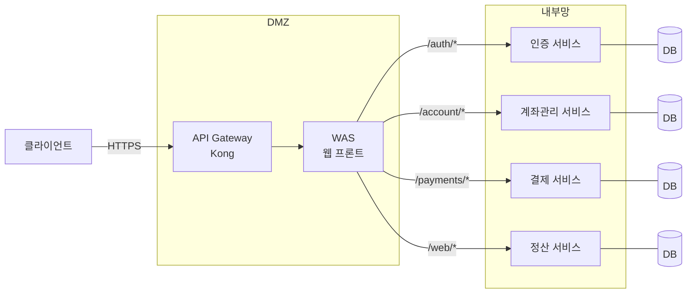
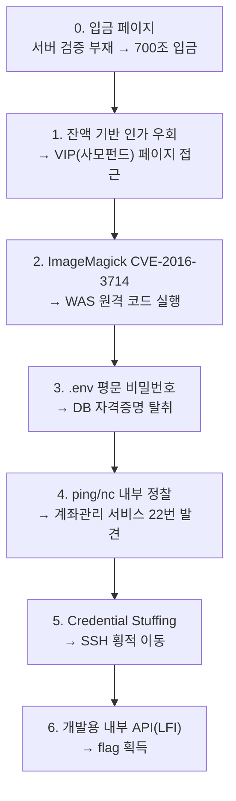
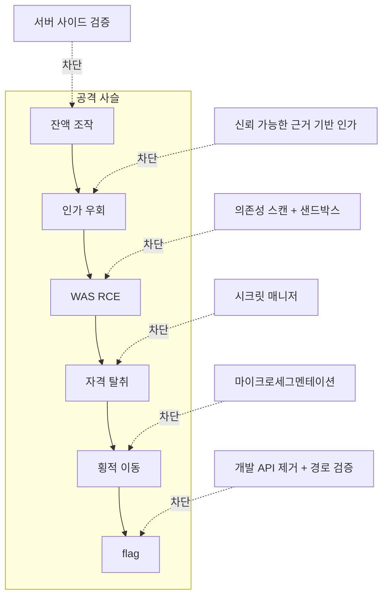

> SECURIOUS 모의해킹팀 6인 팀 프로젝트 (2025년 2학기, 기말발표 2025.12.05).
> 나는 전체 서비스 구조 설계와 상세 설계·API 명세서 작성, 그리고 환경
> 배포를 맡았다. 이 글은 그 프로젝트의 공격 체인을 정리하고, 방어
> 관점에서 다시 읽은 회고다. 방어 분석 부분은 프로젝트에서 구현한 것이
> 아니라, 컨설팅 관점에서 "어디서 끊을 수 있었나"를 따로 정리한 것임을
> 미리 밝혀둔다.

## 왜 체크리스트가 아니라 공격자 시뮬레이션이었나

2024년 한 해 KISA에 접수된 사이버 위협 피해는 1,887건, 전년 대비 48%
증가했다. 그런데 우리가 주목한 건 숫자가 아니라 **피해 기업의 공통점**
이었다. SK텔레콤, 예스24, KT, 롯데카드 — 2024~2025년에 대규모 개인정보
유출을 겪은 이 회사들은 전부 ISMS-P 인증 보유 기업이었다.

이화여대 강은성 교수의 말이 프로젝트의 출발점이었다.

> 체크리스트에는 'O'와 'X'가 있을 뿐 세모도, 중간지대도 없다.
> 체크리스트를 사용하는 보안담당자는 그 체크리스트를 모두 'O'로 만들고
> 그 증빙을 만드는 데 집중해야 한다.

체크리스트 기반 점검은 "각 항목이 충족됐는가"를 본다. 하지만 실제 침해는
**개별 항목이 다 'O'여도, 그것들이 연결되는 틈에서** 일어난다. 입력값
검증도 있고, 인증도 있고, 방화벽도 있는데 — 그 사이를 잇는 경로가
열려 있는 것이다.

그래서 우리는 체크리스트를 채우는 대신, 실제 공격자의 라이프사이클(정보
수집 → 침투 → 취약점 평가 → 침투 후 → 횡적 이동 → PoC)을 흉내 내는
환경을 직접 만들기로 했다. 금융 서비스를 가정한 마이크로서비스 아키텍처를
세우고, 그 안에 의도된 취약점을 심은 뒤, 외부 진입점 하나에서 시작해
내부 깊숙한 곳의 flag까지 도달하는 단일 공격 체인을 설계했다.

## 대상 시스템: 금융 MSA 아키텍처

체크리스트로 보면 이 시스템은 꽤 그럴듯하다. DMZ가 있고, API Gateway가
요청을 라우팅하고, 내부 서비스는 망 분리되어 있다.



- **API Gateway(Kong)**: 외부 요청을 경로별로 라우팅. `/auth/*`,
  `/account/*`, `/payments/*`, `/web/*`
- **DMZ의 WAS**: 사용자에게 보이는 웹 프론트
- **내부망의 4개 서비스**: 인증, 계좌관리, 결제, 정산. 각자 Python
  기반에 자체 DB를 가짐 (MSA를 택한 이유는 6명이 서비스를 하나씩 맡아
  병렬로 구현하되, 서비스 간 API 계약만 맞추면 통합되기 때문이었다)

MSA로 짠 건 단순히 트렌드라서가 아니라, **서비스 간 신뢰 경계를 명시적으로
드러내기 위해서**였다. 모놀리식이라면 "한 번 들어오면 다 보인다"가
당연하지만, MSA에서는 "WAS가 뚫리면 내부 서비스까지 갈 수 있는가?"가
설계 질문이 된다. 공격 체인이 흥미로워지는 지점도 정확히 거기다.

각 서비스의 명세를 맞추는 일이 내 주된 역할이었다. 상세 설계 명세서는
"무엇을 만들지"를 넘어 "어떻게 구현할지"까지 — 예를 들어 토큰 인증이라면
"헤더·페이로드를 Base64 URL 디코딩하여 JSON으로 변환" 수준까지 — 적었고,
API 명세서는 서비스 간 호출 계약을 고정해 6명이 같은 기준으로 구현하게
했다. 돌이켜보면 이 명세 작업이 곧 **공격 표면을 문서화하는 일**이기도
했다. 어떤 엔드포인트가 무엇을 받고 무엇을 돌려주는지 정리하다 보면,
"이건 내부에서만 불려야 하는데 외부에서 닿네" 같은 게 보인다.

## 공격 체인 전체 그림

이 시스템을 관통하는 경로는 이렇게 이어진다. 핵심은 **각 단계 단독으로는
"치명적"이 아니지만, 연결되면 완전 장악**이라는 점이다.



이제 단계별로, **무엇이 뚫렸고 / 왜 뚫렸고 / 어디서 끊을 수 있었나**를
본다.

---

## 0. 클라이언트 사이드 검증만 믿은 입금 페이지

입금 페이지는 "100원 이상 입금 불가"라는 제약을 걸어 두었다. 문제는 그
제약이 **브라우저 자바스크립트에만** 있었다는 것이다. 서버는 들어온
금액을 그대로 신뢰했다.

```javascript
// 클라이언트에만 존재했던 검증 (개념 재현)
if (amount > 100) {
  alert("100원 이상 입금 불가합니다.");
  return; // 여기서 막히지만, 이건 '브라우저의 사정'일 뿐
}
submitDeposit(amount);
```

공격자에게 브라우저의 사정은 의미가 없다. 개발자 도구로 이 분기를
지우거나, 아예 요청을 직접 만들어 보내면 끝이다.

```http
POST /account/deposit HTTP/1.1
Host: target
Content-Type: application/json

{"amount": 700000000000000}
```

서버 사이드 검증이 없으니 잔액은 **700조**가 된다. 우리가 입금 한도를
일부러 700조로 부풀린 건, 다음 단계인 잔액 기반 인가를 트리거하기
위해서였다.

이 취약점의 근거로 우리는 금융보안원 RED IRIS의 인증 우회 취약점
프로파일링 리포트를 참고했다. 흔하고, 사소해 보이고, 그래서 더 자주
방치되는 부류다.

**어디서 끊는가:** 원칙은 하나다 — *클라이언트의 입력은 전부 적대적이라고
가정한다.* 클라이언트 검증은 UX(빠른 피드백)일 뿐, 보안 통제가 아니다.
모든 금액·수량·식별자는 서버에서 다시 검증해야 하고, 특히 금융 도메인은
입금 한도·음수·정수 오버플로·통화 단위까지 서버에서 강제해야 한다.

---

## 1. "잔액이 많으면 VIP" — 조작 가능한 속성에 건 인가

정산 서비스에는 사모펀드(VIP) 페이지(`/web/vip`)가 있고, 일정 잔액
이상인 고객만 접근할 수 있다. 잔액 1,000원일 때 `/web/vip`를 요청하면
정상적으로 거부(40x) 된다.

그런데 0단계로 잔액을 700조로 만든 다음 같은 요청을 보내면 — 페이지가
반환된다.

```http
GET /web/vip HTTP/1.1   # 잔액 1,000원: 거부
GET /web/vip HTTP/1.1   # 잔액 700조:   정상 반환
```

인가 자체는 "있었다". 체크리스트로 보면 '접근 통제: O'다. 문제는 그
인가가 **공격자가 조작할 수 있는 속성(잔액)** 에 의존했다는 것이다.
0단계와 1단계는 따로 보면 각각 "입력 검증 미흡", "접근 통제 우회"라는
중간 등급 결함이지만, 연결되면 "권한 없는 자가 VIP 기능에 접근"이라는
완전한 인가 붕괴가 된다.

이건 OWASP API Security Top 10의 **Broken Function Level
Authorization**과 **비즈니스 로직 취약점**이 겹치는 지점이다.

**어디서 끊는가:** 인가 결정은 *공격자가 바꿀 수 없는 신뢰 가능한
근거*에 둬야 한다. "VIP 등급"이 자격이라면, 그 등급은 잔액에서 실시간
파생되는 게 아니라 서버가 관리하는 별도 속성이어야 하고, 잔액 변동은
검증된 거래를 통해서만 일어나야 한다. 즉 0단계를 막으면 1단계의 전제가
무너진다 — 이게 defense in depth의 핵심이다. 한 겹만 제대로 있어도
체인이 끊긴다.

---

## 2. ImageMagick CVE-2016-3714 (ImageTragick) — WAS 원격 장악

VIP 페이지에는 파일 업로드 기능이 있었고, 서버는 업로드된 이미지를
ImageMagick으로 처리했다. ImageMagick의 CVE-2016-3714, 통칭
**ImageTragick**은 특수하게 조작된 이미지 파일을 처리할 때 셸 명령이
실행되는, 잘 알려진 원격 코드 실행 취약점이다.

핵심은 ImageMagick이 파일을 **내용이 아니라 확장자/매직바이트로
포맷을 추정**하고, MVG/MSL 같은 포맷의 일부 지시자가 외부 명령으로
이어질 수 있다는 데 있다. 대략 이런 형태의 페이로드가 동원된다.

```text
push graphic-context
viewbox 0 0 640 480
image over 0,0 0,0 'https://example.com/image.jpg";<명령>"'
pop graphic-context
```

"그런데 공격자가 서버에서 ImageMagick을 쓰는지 어떻게 아는가?" — 이건
발표에서 우리가 일부러 던진 질문이었다. 답은 정보 수집이다. 에러 메시지,
응답 헤더, 처리 결과물의 메타데이터 같은 데서 처리 엔진의 흔적이 새어
나온다. 공격은 "찍어서" 되는 게 아니라, 앞 단계에서 모은 정보가 다음
선택을 좁히는 식으로 진행된다.

이 단계로 공격자는 DMZ의 WAS에서 **임의 명령 실행** 능력을 얻는다.
외부에 노출된 단 하나의 서버지만, 여기가 내부망으로 가는 교두보가 된다.

**어디서 끊는가:** (1) 알려진 취약 컴포넌트 — ImageMagick 구버전을
그대로 쓴 게 1차 원인이다. SBOM과 의존성 스캔으로 CVE-2016-3714 같은
오래된 RCE는 빌드 단계에서 걸러야 한다. (2) ImageMagick의
`policy.xml`로 위험한 코더(MVG/MSL/HTTPS 등)를 비활성화. (3) 업로드
파일은 매직바이트 검증 + 재인코딩(이미지를 한 번 디코드/리인코드하면
페이로드가 깨진다). (4) 무엇보다 처리 프로세스를 **권한 최소화된 샌드박스**
(별도 컨테이너, seccomp, 비특권 유저)에서 돌렸다면 RCE가 나도 영향이
격리된다.

---

## 3. `.env` 평문 비밀번호 — 침투 후 정보 수집

WAS에 셸을 얻은 공격자가 가장 먼저 하는 일은 둘러보기다. 그리고
애플리케이션 디렉토리의 `.env` 파일에서 DB 접속 비밀번호가 평문으로
나왔다.

```bash
$ cat /app/.env
DB_HOST=10.0.x.x
DB_USER=finance_app
DB_PASSWORD=<평문 비밀번호>
```

이게 흔한 이유는, `.env`가 "코드에 비밀번호를 하드코딩하지 말자"의
해법으로 권장되기 때문이다. 깃에 안 올리는 것까지는 맞는데, **서버에
올라간 평문 파일**이라는 사실은 그대로다. 셸을 얻은 공격자에게 `.env`는
그냥 비밀번호가 적힌 텍스트 파일이다.

**어디서 끊는가:** 비밀은 파일이 아니라 **시크릿 매니저**(AWS Secrets
Manager, Vault 등)에서 런타임에 주입하고, 가능하면 DB는 IAM/IRSA 같은
*비밀번호 없는 인증*으로 접근한다. 정 `.env`를 쓴다면 최소한 앱 실행
유저만 읽도록 권한을 조이고(`chmod 600`), WAS 침해 시 DB 계정이 할 수
있는 일을 최소 권한으로 묶어 "비번이 새도 할 수 있는 게 적도록" 만든다.

---

## 4 & 5. 내부 정찰과 횡적 이동 — 망 분리는 있었지만

여기서부터가 MSA로 설계한 보람이 나오는 구간이다. WAS를 잡았다고 끝이
아니다 — 내부 서비스는 따로 있다. 공격자는 WAS를 발판으로 내부망을
훑는다.

Nmap 같은 도구가 없다는 가정에서, 가장 원시적인 도구만 썼다. `ping`으로
같은 대역의 살아있는 호스트를 찾고, `nc`(netcat)로 포트를 두드린다.

```bash
# 같은 /24 대역 호스트 스캔
for i in $(seq 1 254); do ping -c1 -W1 10.0.x.$i &>/dev/null && echo "up: 10.0.x.$i"; done

# 살아있는 호스트의 22번 포트 확인
nc -zv 10.0.x.x 22
```

이 과정에서 **계좌관리 서비스의 22번(SSH) 포트가 열려 있는 것**을
발견한다. 그리고 앞서 얻은 자격 증명으로 **credential stuffing** — 한
곳에서 얻은 계정 정보를 다른 곳에 재사용 — 을 시도해 SSH 연결에
성공한다. WAS에서 계좌관리 서비스로 횡적 이동이 일어난 것이다.

체크리스트로 보면 "망 분리: O"다. 내부망은 분명히 분리되어 있었다.
하지만 분리는 "경계가 있다"는 뜻일 뿐, **경계 안에서 자유롭게 움직일 수
있는가**는 다른 문제다. 내부 서비스끼리 SSH가 열려 있고 자격 증명이
재사용된다면, 망 분리는 한 번 뚫린 뒤로는 의미가 없다.

**어디서 끊는가:** (1) 내부 서비스에 SSH를 상시 열어두지 않는다 — 운영
접근은 SSM Session Manager 같은 통제된 경로로, 서비스 간 통신은 필요한
포트만. (2) 자격 증명 재사용 금지 — 서비스마다 독립 자격, 가능하면
사람이 외울 필요 없는 워크로드 아이덴티티. (3) **마이크로세그멘테이션**:
"내부망"이라는 한 덩어리가 아니라, WAS는 각 서비스의 *정해진 API
포트로만* 통신하고 그 외(특히 22번)는 기본 차단. WAS가 계좌관리 서비스의
22번에 닿을 수 있다는 것 자체가 설계 결함이다.

---

## 6. 개발용 내부 API — 잊혀진 문이 flag로 가는 길

계좌관리 서비스에 올라탄 공격자는 소스코드를 분석한다. 그리고 개발
중에 쓰고 지우지 않은 내부 API를 발견한다.

```
/settlement/internal/log_viewer?filename=
```

이름 그대로 로그를 보려고 만든 개발용 엔드포인트인데, `filename`
파라미터를 검증하지 않았다. 그래서 로그가 아니라 임의 파일을 읽을 수
있다 — 전형적인 **Local File Inclusion / Path Traversal**이다.

```
/settlement/internal/log_viewer?filename=flag.txt
```

이 한 줄로 최종 목표인 flag를 획득하며 체인이 완성된다. `internal`이라는
경로명이 무색하게, 침투한 공격자에겐 그냥 열린 문이었다.

이건 OWASP API Security Top 10의 **Improper Inventory Management**
(관리되지 않는/문서화되지 않은 API)와 정확히 맞는다. 개발용·디버그용
엔드포인트는 "내부에서만 쓰니까 괜찮다"는 가정 위에 만들어지는데, 그
가정은 0~5단계로 이미 깨져 있었다.

**어디서 끊는가:** (1) 개발/디버그 엔드포인트는 프로덕션 빌드에서 제거 —
존재 자체가 공격 표면이다. (2) "내부 전용"을 경로명이 아니라 실제 통제로
강제 — 네트워크 정책, 인증, 별도 관리망. (3) 파일을 다루는 모든 API는
경로를 화이트리스트/정규화로 검증해 traversal을 차단. (4) API 인벤토리를
관리해 "우리 서비스에 어떤 엔드포인트가 살아있는가"를 항상 파악한다.

---

## 체인을 거꾸로 읽으면 보이는 것

공격 체인의 진짜 교훈은 개별 취약점이 아니라 **연결 구조**에 있다.
각 단계를 위험도만으로 보면 이렇다.

| 단계 | 결함 | 단독 심각도 | 다음 단계에 준 것 |
| --- | --- | --- | --- |
| 0 | 서버 검증 부재 | 중 | 잔액 조작 능력 |
| 1 | 조작 가능 속성 기반 인가 | 중 | VIP 기능(업로드) 접근 |
| 2 | 알려진 RCE(ImageTragick) | 상 | WAS 셸 |
| 3 | 평문 비밀번호 | 중 | DB 자격 증명 |
| 4·5 | SSH 노출 + 자격 재사용 | 중 | 내부 횡적 이동 |
| 6 | 개발용 API + LFI | 중 | flag |

"상"은 하나뿐이다. 나머지는 다 "중"이다. 체크리스트라면 각각 보완 권고로
끝나고, 어쩌면 "수용 가능한 위험"으로 넘어갔을 것이다. 그런데 이 "중"들이
사슬로 엮이자 외부 진입점 하나에서 내부 최심부까지 뚫렸다.

그리고 거꾸로, **이 사슬은 어느 한 고리만 끊어도 무너진다.** 0단계에서
서버 검증만 했어도 1단계 인가 우회의 전제가 사라진다. 2단계에서
ImageMagick만 패치했어도 WAS 셸이 안 나온다. 5단계에서 내부 SSH만
닫았어도 횡적 이동이 막힌다. 이게 방어자에게 주는 위안이자 전략이다 —
완벽할 필요는 없고, **사슬의 어느 지점이든 확실히 끊으면 된다.**

방어를 한 장으로 정리하면 이렇다.



## 내가 이 프로젝트에서 실제로 가져간 것

자랑보다 정직하게 적는다. 이건 6명이 한 팀 프로젝트고, 나는 전체 구조를
설계하고 명세서를 쓰고 환경을 배포한 사람이지, 모든 익스플로잇을 혼자
짠 사람이 아니다. 하지만 구조와 명세를 맡았기 때문에 오히려 분명하게
배운 게 있다.

- **공격 표면은 설계 문서에서 이미 결정된다.** API 명세서를 쓰면서
  엔드포인트를 나열하다 보면, `internal`이 붙은 엔드포인트가 정말 내부
  통제를 받는지, 서비스 간 호출이 최소 포트로 제한되는지가 보인다.
  나중에 6단계에서 터진 개발용 API는, 명세 단계에서 "이건 프로덕션에
  나가면 안 된다"고 표시됐어야 할 것이었다.
- **MSA의 보안은 서비스 안이 아니라 서비스 *사이*에 있다.** 각 서비스를
  아무리 잘 만들어도, WAS가 계좌관리 서비스의 22번에 닿을 수 있으면
  끝이다. 신뢰 경계를 코드가 아니라 네트워크와 아이덴티티로 그어야
  한다는 걸 4·5단계에서 절감했다.
- **컨설팅의 언어는 'O/X'가 아니라 '연결'이다.** 고객에게 "이 항목이
  미흡합니다"가 아니라, "이 중간 결함 셋이 이렇게 연결되면 여기까지
  뚫리고, 그래서 이 한 곳을 먼저 막아야 합니다"라고 말할 수 있어야
  한다. 이 프로젝트는 그 서사를 처음부터 끝까지 만들어 본 경험이었다.

체크리스트는 여전히 필요하다. 다만 그건 바닥이지 천장이 아니다.
ISMS-P를 가진 회사들이 털린 건 체크리스트가 틀려서가 아니라, 체크리스트
바깥의 연결을 아무도 끝까지 따라가 보지 않아서다. 공격자 시뮬레이션은
그 연결을 따라가 보는 일이고, 나는 앞으로도 보안을 이 관점에서 보려고
한다.

---

*이 글의 아키텍처와 공격 단계는 SECURIOUS 모의해킹팀의 2025년 2학기
프로젝트 결과물에 기반한다. 의도적으로 취약하게 만든 학습용 환경이며,
실제 금융 서비스와 무관하다.*
