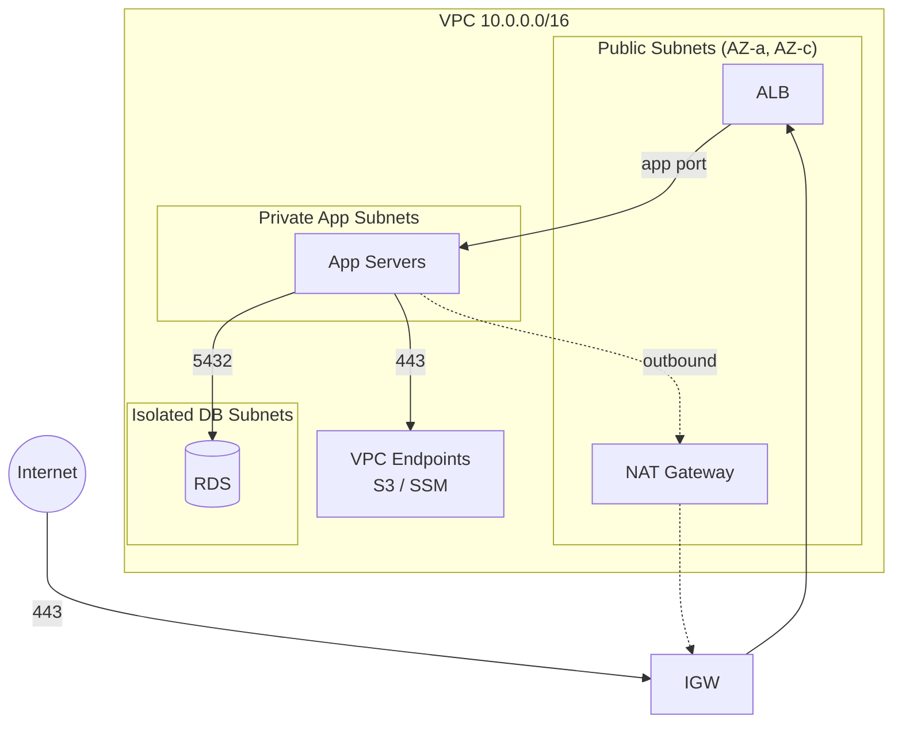

VPC 구축 글은 많지만 대부분 둘 중 하나다. 콘솔 스크린샷 나열이거나,
"모듈 쓰세요"로 끝나거나. 이 글은 **그대로 apply하면 동작하는 VPC
모듈을 처음부터 끝까지 직접 작성**한다. 코드는 AWS Provider 5.x 기준이고,
사이드 프로젝트(월 ~$0)와 프로덕션(고가용성) 두 프리셋을 변수로 오갈 수
있게 설계한다.

> 본문의 모듈 코드 전체는 Terraform 1.14 + AWS Provider 5.x에서
> `terraform validate`를 통과한 상태 그대로 실었다. 코드 블록을
> 파일명대로 복사하면 바로 plan을 뜰 수 있다.

완성하면 이런 구조가 된다.



## 1. CIDR 설계: 코드보다 먼저 정할 것

CIDR는 한 번 정하면 사실상 바꿀 수 없다. 잘못 정하면 나중에 VPC 피어링,
VPN, Transit Gateway를 붙일 때 주소 충돌로 막힌다. 원칙 세 가지:

1. **환경마다 /16 하나씩, 절대 겹치지 않게.** 지금 안 쓰는 환경도 미리
   예약한다.
2. **RFC 1918 대역 중 회사 온프레미스/VPN과 안 겹치는 곳**을 쓴다.
   집/회사 공유기가 주로 192.168.x.x를 쓰므로 10.x가 무난하다.
3. **서브넷은 넉넉하게.** /24(251개 IP)가 작아 보여도 EKS를 올리는 순간
   Pod가 IP를 다 먹는다. 앱 티어는 /20을 권장.

이 글의 주소 계획:

| 환경 | VPC CIDR |
| --- | --- |
| dev | 10.0.0.0/16 |
| stg | 10.1.0.0/16 |
| prod | 10.2.0.0/16 |
| (예약) shared/tools | 10.10.0.0/16 |

VPC 내부는 /16을 `cidrsubnet(cidr, 4, n)`으로 /20 × 16개로 나눠 티어별로
배정한다 (AZ 최대 4개 기준):

| netnum | CIDR (dev 기준) | 용도 |
| --- | --- | --- |
| 0~3 | 10.0.0.0/20 ~ 10.0.48.0/20 | public (AZ별) |
| 4~7 | 10.0.64.0/20 ~ 10.0.112.0/20 | private-app (AZ별) |
| 8~11 | 10.0.128.0/20 ~ 10.0.176.0/20 | isolated-db (AZ별) |
| 12~15 | 10.0.192.0/20 ~ | 예약 |

## 2. 티어 설계: 누가 어디로 나갈 수 있는가

| 티어 | 들어오는 경로 | 나가는 경로 | 배치 대상 |
| --- | --- | --- | --- |
| public | IGW (인터넷) | IGW | ALB, NAT GW |
| private-app | ALB에서만 | NAT GW (아웃바운드만) | EC2, ECS, EKS 노드 |
| isolated-db | app 티어에서만 | **없음** | RDS, ElastiCache |

핵심은 DB 티어다. **라우팅 테이블에 외부 경로 자체를 두지 않는다.**
SG를 잘못 열어도 패킷이 나갈 길이 없는, 이중 방어의 바깥층이다.

## 3. 모듈 뼈대와 변수

```text
modules/network/
├── main.tf        # VPC, 서브넷, 라우팅
├── nat.tf         # NAT 게이트웨이
├── endpoints.tf   # VPC 엔드포인트
├── security.tf    # 보안 그룹 체인
├── flowlogs.tf    # VPC Flow Logs
├── variables.tf
└── outputs.tf
```

```hcl title="modules/network/variables.tf"
variable "name" {
  description = "리소스 이름 접두사 (예: myapp-prod)"
  type        = string
}

variable "vpc_cidr" {
  description = "VPC CIDR — /16 권장"
  type        = string

  validation {
    condition     = can(cidrhost(var.vpc_cidr, 0))
    error_message = "유효한 CIDR 표기여야 합니다 (예: 10.0.0.0/16)."
  }
}

variable "az_count" {
  description = "사용할 가용 영역 수"
  type        = number
  default     = 2

  validation {
    condition     = var.az_count >= 2 && var.az_count <= 4
    error_message = "az_count는 2~4 사이여야 합니다. 프로덕션에서 단일 AZ는 금지."
  }
}

variable "nat_gateway_mode" {
  description = "NAT 구성: none(엔드포인트만) | single(비용 절약) | per_az(고가용성)"
  type        = string
  default     = "single"

  validation {
    condition     = contains(["none", "single", "per_az"], var.nat_gateway_mode)
    error_message = "nat_gateway_mode는 none, single, per_az 중 하나여야 합니다."
  }
}

variable "app_port" {
  description = "ALB가 앱 티어로 전달하는 포트"
  type        = number
  default     = 8080
}

variable "db_port" {
  description = "DB 포트 (PostgreSQL 5432, MySQL 3306)"
  type        = number
  default     = 5432
}

variable "enable_flow_logs" {
  description = "VPC Flow Logs 활성화 여부"
  type        = bool
  default     = true
}

variable "flow_logs_retention_days" {
  type    = number
  default = 90
}

variable "tags" {
  type    = map(string)
  default = {}
}
```

## 4. VPC와 서브넷: for_each 한 번으로 12개까지

티어 × AZ 조합을 locals에서 맵으로 만들어 두면, 서브넷 리소스는 단
하나의 `for_each` 블록으로 끝난다. AZ를 늘려도 코드는 그대로다.

```hcl title="modules/network/main.tf"
data "aws_availability_zones" "available" {
  state = "available"
}

locals {
  azs = slice(data.aws_availability_zones.available.names, 0, var.az_count)

  # 티어별 netnum 오프셋 — /16을 /20 16개로 나눈 주소 계획
  tiers = {
    public = { offset = 0, public = true }
    app    = { offset = 4, public = false }
    db     = { offset = 8, public = false }
  }

  # { "public-ap-northeast-2a" = { tier, az, cidr }, ... } 형태로 평탄화
  subnets = merge([
    for tier, cfg in local.tiers : {
      for i, az in local.azs :
      "${tier}-${az}" => {
        tier = tier
        az   = az
        cidr = cidrsubnet(var.vpc_cidr, 4, cfg.offset + i)
      }
    }
  ]...)
}

resource "aws_vpc" "this" {
  cidr_block           = var.vpc_cidr
  enable_dns_support   = true
  enable_dns_hostnames = true # 인터페이스 엔드포인트 Private DNS에 필수

  tags = merge(var.tags, { Name = var.name })
}

resource "aws_subnet" "this" {
  for_each = local.subnets

  vpc_id            = aws_vpc.this.id
  cidr_block        = each.value.cidr
  availability_zone = each.value.az

  # public 서브넷이어도 자동 퍼블릭 IP는 끈다.
  # ALB는 스스로 퍼블릭 IP를 가지므로 EC2를 public에 직접 둘 때만 필요하다.
  map_public_ip_on_launch = false

  tags = merge(var.tags, {
    Name = "${var.name}-${each.key}"
    Tier = each.value.tier
  })
}

resource "aws_internet_gateway" "this" {
  vpc_id = aws_vpc.this.id
  tags   = merge(var.tags, { Name = var.name })
}

# ── 라우팅 테이블: public 1개, app은 AZ별(NAT 분리 대비), db 1개 ──

resource "aws_route_table" "public" {
  vpc_id = aws_vpc.this.id
  tags   = merge(var.tags, { Name = "${var.name}-public" })
}

resource "aws_route" "public_igw" {
  route_table_id         = aws_route_table.public.id
  destination_cidr_block = "0.0.0.0/0"
  gateway_id             = aws_internet_gateway.this.id
}

resource "aws_route_table" "app" {
  for_each = toset(local.azs)

  vpc_id = aws_vpc.this.id
  tags   = merge(var.tags, { Name = "${var.name}-app-${each.key}" })
}

# db 라우팅 테이블에는 외부로 나가는 경로를 일절 추가하지 않는다
resource "aws_route_table" "db" {
  vpc_id = aws_vpc.this.id
  tags   = merge(var.tags, { Name = "${var.name}-db" })
}

resource "aws_route_table_association" "this" {
  for_each = local.subnets

  subnet_id = aws_subnet.this[each.key].id
  route_table_id = (
    each.value.tier == "public" ? aws_route_table.public.id :
    each.value.tier == "app" ? aws_route_table.app[each.value.az].id :
    aws_route_table.db.id
  )
}
```

`merge([for ...]...)` 패턴이 낯설 수 있는데, 중첩 for로 만든 맵 리스트를
`...`(spread)로 펼쳐 하나의 맵으로 합치는 관용구다. 티어×AZ처럼 2차원
조합을 for_each에 넣을 때 표준적으로 쓴다.

## 5. NAT 전략: 비용과 가용성의 트레이드오프

NAT Gateway는 시간당 과금이다. 서울 리전 기준 대략:

| 모드 | 월 비용 (NAT만) | 동작 | 용도 |
| --- | --- | --- | --- |
| `none` | $0 | 아웃바운드 불가, 엔드포인트로만 AWS API 접근 | 사이드 프로젝트, 폐쇄망 |
| `single` | 약 $42 + 데이터 | AZ 하나에만 NAT — 해당 AZ 장애 시 아웃바운드 중단 | dev/stg, 소규모 prod |
| `per_az` | 약 $42 × AZ 수 | AZ별 독립 NAT + AZ 간 데이터 요금 절약 | prod |

```hcl title="modules/network/nat.tf"
locals {
  nat_azs = (
    var.nat_gateway_mode == "per_az" ? local.azs :
    var.nat_gateway_mode == "single" ? [local.azs[0]] :
    []
  )
}

resource "aws_eip" "nat" {
  for_each = toset(local.nat_azs)

  domain = "vpc"
  tags   = merge(var.tags, { Name = "${var.name}-nat-${each.key}" })
}

resource "aws_nat_gateway" "this" {
  for_each = toset(local.nat_azs)

  allocation_id = aws_eip.nat[each.key].id
  subnet_id     = aws_subnet.this["public-${each.key}"].id

  tags = merge(var.tags, { Name = "${var.name}-${each.key}" })

  # IGW가 먼저 있어야 NAT가 외부와 통신할 수 있다
  depends_on = [aws_internet_gateway.this]
}

# app 티어 기본 경로: per_az면 같은 AZ의 NAT, single이면 유일한 NAT
resource "aws_route" "app_nat" {
  # 주의: `cond ? [] : toset(...)`는 타입 불일치 에러 — toset 안에서 분기한다
  for_each = toset(var.nat_gateway_mode == "none" ? [] : local.azs)

  route_table_id         = aws_route_table.app[each.key].id
  destination_cidr_block = "0.0.0.0/0"
  nat_gateway_id = (
    var.nat_gateway_mode == "per_az"
    ? aws_nat_gateway.this[each.key].id
    : aws_nat_gateway.this[local.nat_azs[0]].id
  )
}
```

흔한 실수: NAT Gateway를 **private 서브넷에 만드는 것**. NAT 자체는
IGW로 나가야 하므로 반드시 public 서브넷에 둔다. 위 코드는
`aws_subnet.this["public-${each.key}"]` 참조로 이를 구조적으로 강제한다.

## 6. 보안 그룹 체인: CIDR가 아니라 SG를 참조하라

SG 설계의 제1원칙은 **소스에 IP 대역이 아니라 SG ID를 쓰는 것**이다.
"app 서브넷 CIDR에서 5432 허용"은 그 서브넷의 모든 것(침해된 인스턴스
포함 가능성)을 허용하지만, "app SG에서 5432 허용"은 그 SG를 단 대상만
허용한다. 오토스케일링으로 IP가 바뀌어도 규칙은 그대로다.

설계할 체인:

| SG | Ingress | Egress |
| --- | --- | --- |
| alb | 443 ← 0.0.0.0/0 | app_port → app SG |
| app | app_port ← alb SG | 443 → 인터넷(패키지/외부 API), db_port → db SG |
| db | db_port ← app SG | **없음** |
| endpoints | 443 ← app SG | 없음 |

알아둘 Terraform 동작 두 가지:

- **Terraform은 SG 생성 시 AWS의 기본 allow-all egress를 제거한다.**
  콘솔로 만들면 egress 전체 허용이 기본이지만, Terraform 관리 SG는
  명시한 egress만 남는다. db SG에 egress를 안 쓰면 정말 아무것도 못
  나간다 — 의도된 동작이다 (Stateful이라 응답 트래픽은 나간다).
- 규칙은 인라인 블록 대신 **`aws_vpc_security_group_ingress_rule` /
  `egress_rule` 리소스**(Provider 5.0+)로 분리한다. 인라인과 혼용하면
  서로 규칙을 지우는 충돌이 난다. 규칙당 리소스 하나라 개별 추적도 된다.

```hcl title="modules/network/security.tf"
resource "aws_security_group" "alb" {
  name_prefix = "${var.name}-alb-"
  description = "ALB - internet facing"
  vpc_id      = aws_vpc.this.id

  tags = merge(var.tags, { Name = "${var.name}-alb" })

  # SG 교체가 필요할 때 새것 생성 → 참조 변경 → 구버전 삭제 순서 보장.
  # name_prefix는 이때 이름 충돌을 피하기 위해 필수다.
  lifecycle {
    create_before_destroy = true
  }
}

resource "aws_vpc_security_group_ingress_rule" "alb_https" {
  security_group_id = aws_security_group.alb.id
  description       = "HTTPS from internet"
  ip_protocol       = "tcp"
  from_port         = 443
  to_port           = 443
  cidr_ipv4         = "0.0.0.0/0"
}

# HTTP는 ALB 리스너에서 443 리다이렉트용으로만 연다 (선택)
resource "aws_vpc_security_group_ingress_rule" "alb_http_redirect" {
  security_group_id = aws_security_group.alb.id
  description       = "HTTP redirect to HTTPS"
  ip_protocol       = "tcp"
  from_port         = 80
  to_port           = 80
  cidr_ipv4         = "0.0.0.0/0"
}

resource "aws_vpc_security_group_egress_rule" "alb_to_app" {
  security_group_id            = aws_security_group.alb.id
  description                  = "To app tier only"
  ip_protocol                  = "tcp"
  from_port                    = var.app_port
  to_port                      = var.app_port
  referenced_security_group_id = aws_security_group.app.id
}

# ── App ──

resource "aws_security_group" "app" {
  name_prefix = "${var.name}-app-"
  description = "Application tier"
  vpc_id      = aws_vpc.this.id

  tags = merge(var.tags, { Name = "${var.name}-app" })

  lifecycle {
    create_before_destroy = true
  }
}

resource "aws_vpc_security_group_ingress_rule" "app_from_alb" {
  security_group_id            = aws_security_group.app.id
  description                  = "App port from ALB only"
  ip_protocol                  = "tcp"
  from_port                    = var.app_port
  to_port                      = var.app_port
  referenced_security_group_id = aws_security_group.alb.id
}

resource "aws_vpc_security_group_egress_rule" "app_https_out" {
  security_group_id = aws_security_group.app.id
  description       = "HTTPS outbound (packages, external APIs)"
  ip_protocol       = "tcp"
  from_port         = 443
  to_port           = 443
  cidr_ipv4         = "0.0.0.0/0"
}

resource "aws_vpc_security_group_egress_rule" "app_to_db" {
  security_group_id            = aws_security_group.app.id
  description                  = "To DB tier"
  ip_protocol                  = "tcp"
  from_port                    = var.db_port
  to_port                      = var.db_port
  referenced_security_group_id = aws_security_group.db.id
}

# ── DB: ingress는 app에서만, egress는 아예 없음 ──

resource "aws_security_group" "db" {
  name_prefix = "${var.name}-db-"
  description = "Database tier - no egress"
  vpc_id      = aws_vpc.this.id

  tags = merge(var.tags, { Name = "${var.name}-db" })

  lifecycle {
    create_before_destroy = true
  }
}

resource "aws_vpc_security_group_ingress_rule" "db_from_app" {
  security_group_id            = aws_security_group.db.id
  description                  = "DB port from app tier only"
  ip_protocol                  = "tcp"
  from_port                    = var.db_port
  to_port                      = var.db_port
  referenced_security_group_id = aws_security_group.app.id
}
```

눈여겨볼 것:

- **SSH(22) 규칙이 어디에도 없다.** 접속은 7장의 SSM Session Manager로
  한다. "내 IP에서 22 허용"은 IP가 바뀔 때마다 규칙이 늘어나다가 결국
  0.0.0.0/0이 되는 길이다.
- app의 egress 443이 마음에 걸리면(데이터 유출 채널) 프록시나 방화벽
  도입 전 단계로 `cidr_ipv4`를 외부 API 대역으로 좁히거나, S3는 아래
  prefix list로 분리할 수 있다.

## 7. VPC Endpoint: NAT 없이 AWS API 쓰기

S3 Gateway 엔드포인트는 **무료**다. 안 달 이유가 없다. SSM 인터페이스
엔드포인트 3종을 더하면 NAT 없이도(=`nat_gateway_mode = "none"`) 프라이빗
인스턴스에 셸 접속이 된다.

```hcl title="modules/network/endpoints.tf"
data "aws_region" "current" {}

# S3 Gateway — 무료. 라우팅 테이블에 경로로 주입된다
resource "aws_vpc_endpoint" "s3" {
  vpc_id            = aws_vpc.this.id
  service_name      = "com.amazonaws.${data.aws_region.current.name}.s3"
  vpc_endpoint_type = "Gateway"

  route_table_ids = concat(
    [for rt in aws_route_table.app : rt.id],
    [aws_route_table.db.id]
  )

  tags = merge(var.tags, { Name = "${var.name}-s3" })
}

# 인터페이스 엔드포인트용 SG: app 티어에서 443만
resource "aws_security_group" "endpoints" {
  name_prefix = "${var.name}-vpce-"
  description = "Interface endpoints"
  vpc_id      = aws_vpc.this.id

  tags = merge(var.tags, { Name = "${var.name}-vpce" })

  lifecycle {
    create_before_destroy = true
  }
}

resource "aws_vpc_security_group_ingress_rule" "endpoints_from_app" {
  security_group_id            = aws_security_group.endpoints.id
  description                  = "HTTPS from app tier"
  ip_protocol                  = "tcp"
  from_port                    = 443
  to_port                      = 443
  referenced_security_group_id = aws_security_group.app.id
}

# SSM Session Manager에 필요한 3종 세트
resource "aws_vpc_endpoint" "ssm" {
  for_each = toset(["ssm", "ssmmessages", "ec2messages"])

  vpc_id              = aws_vpc.this.id
  service_name        = "com.amazonaws.${data.aws_region.current.name}.${each.key}"
  vpc_endpoint_type   = "Interface"
  private_dns_enabled = true
  security_group_ids  = [aws_security_group.endpoints.id]

  subnet_ids = [
    for key, s in local.subnets : aws_subnet.this[key].id
    if s.tier == "app"
  ]

  tags = merge(var.tags, { Name = "${var.name}-${each.key}" })
}

# app SG에서 S3로의 egress를 prefix list로 정밀 허용 (선택)
resource "aws_vpc_security_group_egress_rule" "app_to_s3" {
  security_group_id = aws_security_group.app.id
  description       = "S3 via gateway endpoint"
  ip_protocol       = "tcp"
  from_port         = 443
  to_port           = 443
  prefix_list_id    = aws_vpc_endpoint.s3.prefix_list_id
}
```

인터페이스 엔드포인트는 개당 월 약 $10 + 데이터 요금이다. 3종이면 월
$30 정도 — single NAT($42)보다 싸고, NAT와 달리 트래픽이 AWS 네트워크를
벗어나지 않는다.

## 8. VPC Flow Logs: 거부된 트래픽이 보이게

```hcl title="modules/network/flowlogs.tf"
resource "aws_cloudwatch_log_group" "flow" {
  count = var.enable_flow_logs ? 1 : 0

  name              = "/vpc/${var.name}/flow-logs"
  retention_in_days = var.flow_logs_retention_days

  tags = var.tags
}

data "aws_iam_policy_document" "flow_assume" {
  statement {
    actions = ["sts:AssumeRole"]

    principals {
      type        = "Service"
      identifiers = ["vpc-flow-logs.amazonaws.com"]
    }
  }
}

resource "aws_iam_role" "flow" {
  count = var.enable_flow_logs ? 1 : 0

  name_prefix        = "${var.name}-flow-"
  assume_role_policy = data.aws_iam_policy_document.flow_assume.json

  tags = var.tags
}

resource "aws_iam_role_policy" "flow" {
  count = var.enable_flow_logs ? 1 : 0

  name_prefix = "flow-logs-"
  role        = aws_iam_role.flow[0].id

  policy = jsonencode({
    Version = "2012-10-17"
    Statement = [{
      Effect = "Allow"
      Action = [
        "logs:CreateLogStream",
        "logs:PutLogEvents",
        "logs:DescribeLogGroups",
        "logs:DescribeLogStreams",
      ]
      Resource = "${aws_cloudwatch_log_group.flow[0].arn}:*"
    }]
  })
}

resource "aws_flow_log" "this" {
  count = var.enable_flow_logs ? 1 : 0

  vpc_id          = aws_vpc.this.id
  traffic_type    = "ALL" # 비용이 부담되면 REJECT만으로도 이상 탐지엔 충분
  iam_role_arn    = aws_iam_role.flow[0].arn
  log_destination = aws_cloudwatch_log_group.flow[0].arn

  tags = merge(var.tags, { Name = var.name })
}
```

## 9. 출력과 사용 예

```hcl title="modules/network/outputs.tf"
output "vpc_id" {
  value = aws_vpc.this.id
}

output "subnet_ids" {
  description = "티어별 서브넷 ID 맵"
  value = {
    for tier in keys(local.tiers) : tier => [
      for key, s in local.subnets : aws_subnet.this[key].id if s.tier == tier
    ]
  }
}

output "security_group_ids" {
  value = {
    alb       = aws_security_group.alb.id
    app       = aws_security_group.app.id
    db        = aws_security_group.db.id
    endpoints = aws_security_group.endpoints.id
  }
}

output "nat_public_ips" {
  description = "외부 서비스 IP 허용 목록에 등록할 NAT 고정 IP"
  value       = [for eip in aws_eip.nat : eip.public_ip]
}
```

호출은 환경 디렉토리에서. 같은 모듈, 다른 프리셋:

```hcl title="environments/dev/network/main.tf"
# 사이드 프로젝트 프리셋: NAT 없이 월 $30 (SSM 엔드포인트만)
module "network" {
  source = "../../../modules/network"

  name             = "myapp-dev"
  vpc_cidr         = "10.0.0.0/16"
  az_count         = 2
  nat_gateway_mode = "none"
  enable_flow_logs = false

  tags = { Environment = "dev", Project = "myapp" }
}
```

```hcl title="environments/prod/network/main.tf"
# 프로덕션 프리셋: AZ별 NAT, Flow Logs 1년 보관
module "network" {
  source = "../../../modules/network"

  name                     = "myapp-prod"
  vpc_cidr                 = "10.2.0.0/16"
  az_count                 = 3
  nat_gateway_mode         = "per_az"
  enable_flow_logs         = true
  flow_logs_retention_days = 365

  tags = { Environment = "prod", Project = "myapp" }
}

output "db_subnet_ids" {
  value = module.network.subnet_ids["db"] # RDS subnet group에 그대로 사용
}
```

## 10. 배포 후 검증

apply가 성공했다고 끝이 아니다. 의도한 경계가 실제로 동작하는지 확인한다.

```bash
# 1. 서브넷이 계획한 CIDR대로 만들어졌는가
aws ec2 describe-subnets \
  --filters "Name=vpc-id,Values=$VPC_ID" \
  --query 'Subnets[].[Tags[?Key==`Name`].Value|[0],CidrBlock,AvailabilityZone]' \
  --output table

# 2. db 라우팅 테이블에 0.0.0.0/0 경로가 없는가 (있으면 설계 위반)
aws ec2 describe-route-tables \
  --filters "Name=vpc-id,Values=$VPC_ID" "Name=tag:Name,Values=*-db" \
  --query 'RouteTables[].Routes[?DestinationCidrBlock==`0.0.0.0/0`]'

# 3. app 인스턴스에 SSH 없이 접속되는가 (SSM 엔드포인트 검증)
aws ssm start-session --target $INSTANCE_ID

# 4. Reachability Analyzer로 ALB→app 경로 확인 (시작/대상 ENI 지정)
aws ec2 create-network-insights-path \
  --source $ALB_ENI --destination $APP_ENI \
  --destination-port 8080 --protocol tcp
```

3번이 특히 중요하다. `nat_gateway_mode = "none"`에서 SSM 접속이 되면
엔드포인트 구성이 전부 맞다는 뜻이다 (인스턴스 프로파일에
`AmazonSSMManagedInstanceCore` 정책은 별도로 필요하다).

## 11. 흔한 실수 정리

1. **NAT를 private 서브넷에 생성** — 아웃바운드 전체 불통. 코드 레벨에서
   public 서브넷 참조를 강제하면 원천 차단된다.
2. **DB SG에 app 서브넷 CIDR 허용** — SG 참조로 바꿀 것. CIDR 허용은
   해당 대역의 모든 것을 신뢰한다는 의미다.
3. **인라인 SG 규칙과 별도 규칙 리소스 혼용** — apply할 때마다 서로
   규칙을 지운다. 한 SG는 한 방식만.
4. **`create_before_destroy` 없는 SG 교체** — 다른 리소스가 참조 중인
   SG는 삭제가 안 되어 apply가 멈춘다. `name_prefix`와 세트로 넣는다.
5. **enable_dns_hostnames 누락** — 인터페이스 엔드포인트의 Private DNS가
   동작하지 않아 SDK가 퍼블릭 엔드포인트로 나가려다 실패한다.
6. **RDS subnet group을 단일 AZ 서브넷으로 구성** — Multi-AZ 전환이
   필요할 때 재구축해야 한다. 처음부터 2개 AZ 이상.
7. **`terraform destroy`로 NAT EIP만 남는 경우** — EIP는 연결 해제
   상태로도 과금된다. destroy 후 EIP 잔존 여부를 확인한다.

## 비용 요약 (서울 리전, 대략)

| 구성 | 월 비용 |
| --- | --- |
| VPC, 서브넷, RT, IGW, SG, S3 Gateway EP | $0 |
| 인터페이스 엔드포인트 (SSM 3종) | ~$30 |
| NAT single | ~$42 + GB당 $0.059 |
| NAT per_az (3 AZ) | ~$126 + 데이터 |
| Flow Logs | 수집 GB당 과금 — REJECT만 수집 시 소액 |

사이드 프로젝트라면 `nat_gateway_mode = "none"` + 컨테이너 이미지를 ECR
(S3 기반이라 Gateway EP로 충분) 에서 받는 구성으로 네트워크 비용을
사실상 0으로 만들 수 있다.

---

다음 글에서는 이 모듈을 팀이 운영하는 구조 — 리포지토리 레이아웃, 모듈
버저닝, OIDC 기반 CI/CD — 에 얹는 과정을 다룬다:
[엔터프라이즈 Terraform 운영 구조](/techblog/blog/terraform-enterprise-structure/)
